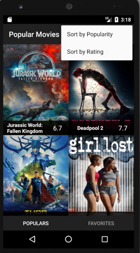

Popular Movies
============================

This is an app that provides movies information, and user can sort movies by popularity or ratings.

Movies information fetch from [The movie database](https://www.themoviedb.org/) API.

How To Use
============================

Download and unzip, open by Android Studio or other IDE.

Environment
=============================

AndroidSdk version:
minSdkVersion 15
targetSdkVersion 26

Built With
=============================

IDE:
*	[Android Studio](https://developer.android.com/studio/index.html)

Library:
*	[Picasso](http://square.github.io/picasso/)

Author
=============================

[Henry Wu](https://github.com/henry32144)