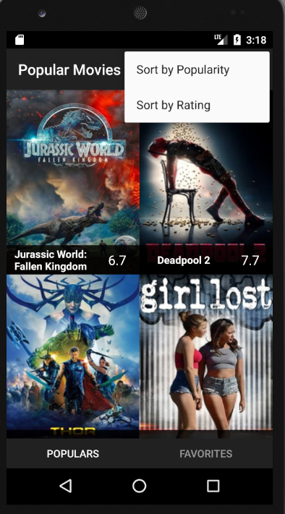

Popular Movies
============================

這是一個可以取得電影資訊的app，使用者可以根據熱門度或是評分排序電影。

電影資訊從[The movie database](https://www.themoviedb.org/)網站提供的API獲取。

How To Use
============================

下載解壓縮之後，用Android Studio開啟

Environment
=============================

AndroidSdk version:

minSdkVersion 15

targetSdkVersion 26

Built With
=============================

IDE:
*	[Android Studio](https://developer.android.com/studio/index.html)

Library:
*	[Picasso](http://square.github.io/picasso/)

Author
=============================

[Henry Wu](https://github.com/henry32144)